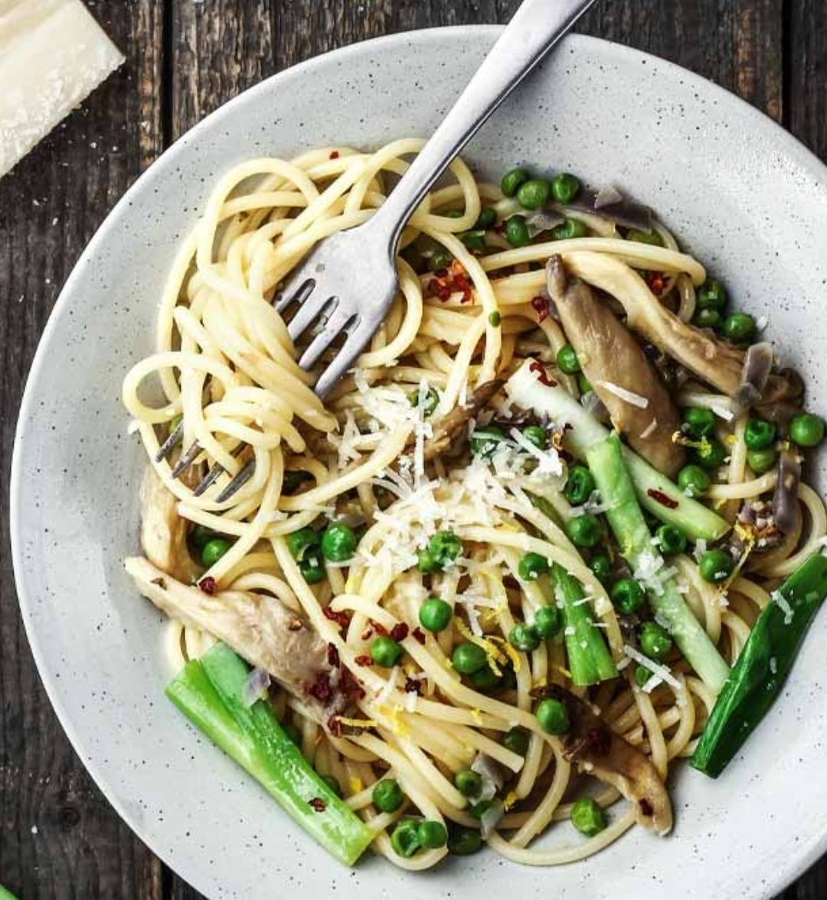

For my first actual dish I chose to go with this very easy but tasty little meal.

## Ingredients (2 Servings):
+ **200g Oyster Mushrooms** 🍄 (or any other, but these are my favorite)
+ **120g Frozen Green Peas** 💚
+ **30g Parmesan** 🧀
+ **200g Pasta** 🍝 (personal preference)
+ **2 Green Onions**
+ **1/2 Red Onion**
+ **Olive Oil** (2 tablespoons)
+ **1 Clove of Garlic**
+ **Spices** 🌶️ (Pepper, Salt, Oregano, Chilli)

## Cooking Steps

### 1. Cook Pasta
Cook your pasta al dente according to package instructions. In between, pour some pasta water into a cup and set it aside. *(200g Pasta)*

### 2. Peel and Dice
Peel and finely dice onion and garlic. *(1/2 Red Onion, 1 Clove Garlic)*

### 3. Mushrooms
Wash and cut mushrooms into thick slices. *(200g Mushrooms)*

### 4. Green Onion
Clean green onion and cut into finger-long pieces. *(2 green onions)*

### 5. Sauté Onion and Garlic - Medium Heat
Heat olive oil in pan at medium heat. Add diced onions and garlic for **1-2 minutes⏱️**, until glassy 😋 *(2 TS olive oil)*

### 6. Add Peas
Add peas and some of the pasta water. Then let it simmer for about **3 minutes⏱️**.

### 7. Add Mushrooms and Green Onions
Add the prepared mushrooms as well as the green onions. Add flavours like chilli, pepper or other spices. Let everything cook for ~**5 minutes⏱️**.

### 8. Mix Well and Serve
Mix with Pasta and add some more pasta water if desired. Season with parmesan, pepper, salt and oregano.

**Buon appetito!**

#### Nutrition Facts
| Cal | Protein | Fat | Carb |
|-----|---------|-----|------|
| 544 | 24g     | 15g | 75g  |

_Original recipe by [Meike](http://smamunir.de)_